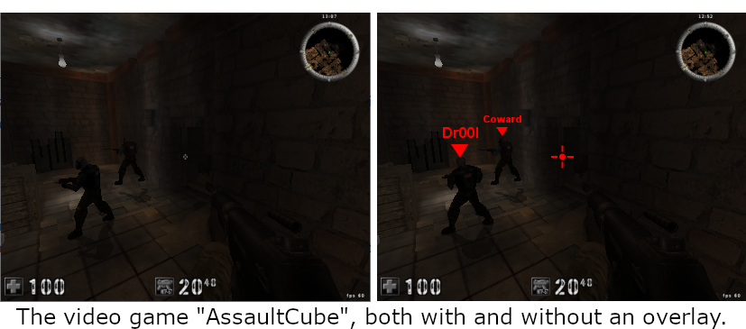
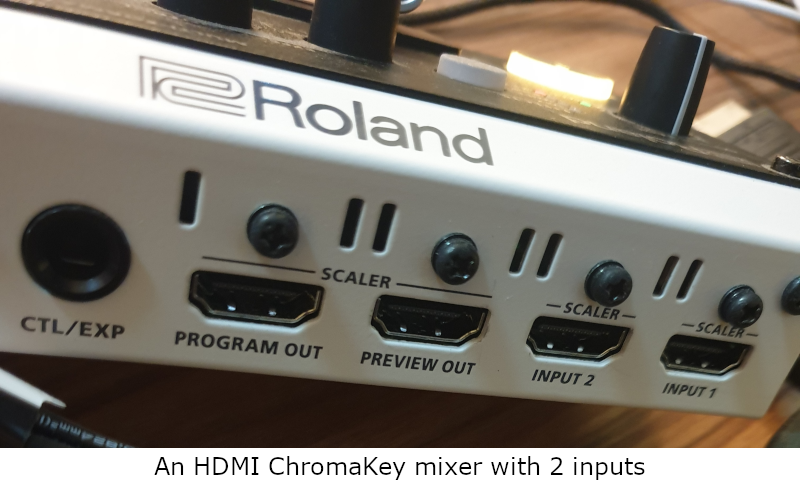
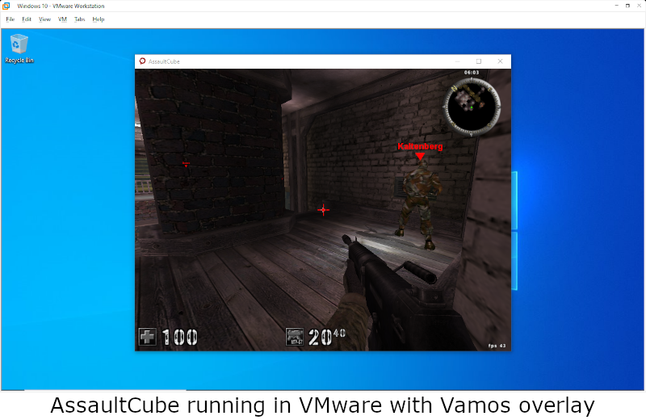

# Introduction

In a nutshell, Vamos is a system for creating visual overlays for 3rd party computer software, and for monetizing those
overlays. For example, it can be used to add a crosshair or other information to a video game. Additionally, with the
proper hardware, the overlay can be shown without installing any software whatsoever on the target machine.

Here is a short [YouTube Demo](https://youtu.be/xJMp0Bu-_vc) of Vamos in action.

**You can make money writing overlays for Vamos.** You choose your own price, and you receive 90% of the chosen price (I
get the other 10% for developing Vamos).

Vamos is great for streamers! With a two-machine installation, there is zero chance of accidentally streaming your use
of an overlay.

# Pricing

Vamos itself is completely free. Overlay authors, however, can charge for their overlay, and payment is made using the
Nano (XNO) cryptocurrency. These payments encourage overlay authors to produce quality overlays, and to keep their
overlays up to date. The reason I chose Nano is that it is fast, and charges zero transaction fees.

You can get some free Nano by using a [Nano faucet](https://hub.nano.org/i/faucets/215). This will be enough to run the
sample overlays.

# Single Machine Installation

While it is entirely possible to install everything on a single machine, it is not recommended installing Vamos on any
machine where you play online video games. The overlay will function, but the game itself may not. The anti-cheat
component of modern video games may detect Vamos, and disallow play with Vamos running. If you wish to run an overlay on
a gaming machine, I recommend following the instructions under [Two-Machine Installation](#two-machine-installation)
or [Virtual Machine Installation](#virtual-machine-installation) instead.

For a single machine installation, a total of 3 components will need to be installed:

* [Tor Browser](https://www.torproject.org/download/) - Used to protect privacy when downloading overlays, and when
  updating Vamos itself.
* [ceserverj](https://github.com/isabellaflores/ceserverj) - Provides memory acquisition services to Vamos.
* [Vamos](https://github.com/isabellaflores/vamos) - The main program you will use to download and launch overlays, and
  to interact with the Vamos ecosystem.

Then, just launch Tor Browser, launch ceserverj, then launch Vamos and start using it.

# Two-Machine Installation

In this section, I will describe the procedure to set up Vamos using two interlinked machines. In this way, a Vamos
overlay can be used without ever installing any software on the target machine. For this method, you will need to have
invested in a PCILeech-compatible memory acquisition device. A list of supported acquisition devices can be found on
the [PCILeech website](https://github.com/ufrisk/pcileech#memory-acquisition-methods). I recommend choosing a device
that supports at least 150MB/s. The faster the device, the more responsive the overlay will be.

I will use the following terminology:

<ul class="bodyText">
    <li>The <b>source machine</b> is the machine running Vamos software.</li>
    <li>The <b>target machine</b> is the machine with the hardware memory acquisition device; this is
        the machine that is running your video game or other software that you wish to overlay upon. 
        <b><i>No software should ever need to be installed on this machine.</i></b>
    </li>
</ul>

A total of 4 components will need to be installed on the <b>source</b> machine:

* [MemProcFS](https://github.com/ufrisk/MemProcFS) - The PCILeech software that runs on the source machine, that talks
  to the hardware memory acquisition device installed in the target machine, typically over a USB-C cable. Please ensure
  that MemProcFS is configured properly, and works in a standalone fashion, before trying to use it with Vamos.
* [Tor Browser](https://www.torproject.org/download/) - Used to protect privacy when downloading overlays, and when
  updating Vamos itself.
* [ceserver-pcileech](https://github.com/isabellaflores/ceserver-pcileech) - Provides memory acquisition services
  between the source and target machines.
* [Vamos](https://github.com/isabellaflores/vamos) - The main program you will use to download and launch overlays, and
  to interact with the Vamos ecosystem.

At this point, you will have two machines linked with a USB-C cable via the hardware memory acquisition device.
Launching an overlay will display that overlay on the source machine's screen, but you really want the overlay to
display on the target machine's screen, overlaying the content on that screen. There are a few ways to do this:

* [Steam Remote Play](https://youtu.be/nuX2vxdQiOc?t=91), Remote Desktop, or any other program that lets you cast the
  screen of the target machine onto the source machine.
* Use a video capture card to cast the target machine's display onto the source machine so the overlay can be drawn on
  it.
* Use a chromakey video mixer to mix the source and target video signals onto a single monitor. The mixer should support
  chroma-key, and the transparency chroma color should be set to black. The target machine's display will show through
  any black pixels o the overlay running on the source machine.

Keep in mind that any screen casting solution will introduce some latency, so you will want to do your homework to find
the solutions with the least latency. With too much latency, certain games such as First Person Shooters may become
difficult to play, while other types of games are less affected by latency issues.

# Virtual Machine Installation

In this section, I will describe the procedure to set up Vamos using a VMware virtual machine. In this way, a Vamos
overlay can be drawn by the host on the display window of a VMware virtual machine, without needing to install any
software on the virtual machine itself. No special memory acquisition hardware is needed for this method. We will use
the [PCILeech 'vmware' driver](https://github.com/ufrisk/LeechCore/wiki/Device_VMWare) for this method.

A total of 4 components will need to be installed on the <b>host</b> machine:

* [MemProcFS](https://github.com/ufrisk/MemProcFS) - The PCILeech software that runs on the host machine, that talks to
  the hardware memory acquisition device installed in the virtual machine, using
  the [PCILeech 'vmware' driver](https://github.com/ufrisk/LeechCore/wiki/Device_VMWare). Please ensure that MemProcFS
  is configured properly, and works in a standalone fashion, before trying to use it with Vamos.
* [Tor Browser](https://www.torproject.org/download/) - Used to protect privacy when downloading overlays, and when
  updating Vamos itself.
* [ceserver-pcileech](https://github.com/isabellaflores/ceserver-pcileech) - Provides memory acquisition services
  between the VMware host and guest machines.
* [Vamos](https://github.com/isabellaflores/vamos) - The main program you will use to download and launch overlays, and
  to interact with the Vamos ecosystem.

To use, just launch your virtual machine, Tor Browser, ceserver-pcileech, and Vamos. Once all 4 are running and properly
configured, you can start using your Vamos overlays. You will need to either use VMware's Unity mode, or enter the pixel
coordinates of the VMware display window into Vamos under
**Edit->Target Display**.

# Developing an Overlay

For a developer, Vamos provides:

* integrated cryptocurrency subsystem, so you get paid
* TOR support to protect your anonymity
* a trust model, including sandboxed code and digital signatures
* FPGA/DMA support for customers running a dual-box setup
* A consistent API for accessing process memory and other functions
* easy distribution and updates via VAMOS urls

You can use my [sample overlay](https://github.com/isabellaflores/sample-overlay) as a starting point for your own
overlay.

Overlays are written in Java. They are run within a restrictive Java sandbox on the user's machine, so you will not be
able to write files or make network connections in your overlay code. An API is available to your overlay to perform the
following functions:

* Fetch the list of running processes on the target machine
* Read the memory of any process on the target machine
* Store arbitrary data in a special cache that persists between launches

[SDK Javadoc](https://raw.githubusercontent.com/isabellaflores/vamos/master/sdk-javadoc/index.html)

Based on this information, you can use Java's Swing UI toolkit to draw your overlay on the source machine's screen.
Included in the Vamos SDK is a special <b>iflores.vamos.OverlayFrame</b> class which produces a transparent window in
which you can draw your overlay for the user.

**Avoid using an alpha component when drawing your overlay. Chromakey video mixers don't support alpha. Additionally,
black is the recommended chromakey transparency color, so avoid using black or other very dark colors in your overlay if
you want them to be usable by chromakey hardware.**

Follow these steps to create your own custom overlay:

<ol>
    <li>Check out my [sample overlay](https://github.com/isabellaflores/sample-overlay) as a starting point.</li>
    <li>Create your custom overlay by modifying the overlay code.</li>
    <li>Make sure the "Dev Server" is running first by clicking the appropriate button in the <b>Developer Tools</b> window within Vamos.</li>
    <li>Test your overlay by running the <b>iflores.vamos.VamosMain</b> main class within your IDE, passing your overlay subclass name as args[0].</li>
    <li>Edit the TXT file in the <b>pkg</b> subdirectory, providing a description of your overlay.</li>
    <li>Edit the JSON file in the <b>pkg</b> subdirectory, providing per-diem pricing and other info.</li>
    <li>Build your overlay by using the Maven 'package' goal. The resulting JAR file is placed into the <b>pkg</b> subdirectory for you.</li>
</ol>

In order to distribute your overlay, you must perform the following steps:

<ol>
    <li>Open the Developer Tools window within Vamos</li>
    <li>Generate a new identity if you haven't already done so. <b>Make a copy of this identity using the 'Export Identity' button, and store it somewhere safe.</b> If you lose this identity, you will lose the ability to provide updates to your overlay.</li>
    <li>Cryptographically sign your package using the 'Sign Overlay' button. You will only need to select the <b>.json</b> file in the dialog, but all 3 files will be signed. The signing process will create 3 additional <b>.signature</b> files, for a total of 6 files now in the <b>pkg</b> directory.</li>
    <li>Copy these 6 files to a web server, which <b><i>may</i></b> be behind a TOR hidden service (.onion domain), since the user is guaranteed to have an operational TOR connection.</li>
    <li>Locate the web URL of the <b>.json</b> file</li>
    <li>Remove the <b>.json</b> suffix from the URL - this is your metadata base url</li>
    <li>Click the "Make Vamos URL" button in the Developer Tools window of Vamos, and paste this metadata base url to produce your vamos: url.</li>
    <li>Distribute this vamos: URL to people who wish to download your overlay.</li>
</ol>

The vamos: URL has embedded in it your cryptographic public key. This ensures download integrity, and even if your web
server is hacked, it is impossible for the hacker to replace your software with a rogue copy. This URL will remain
unchanged across updates to your overlay, and only needs to be generated once. Anyone using the URL will always get the
latest deployed version of your overlay.